# 탄천런 (TancheonRun)

> 성남 탄천 주변 뉴비 러너가, 전국 랭킹에서는 의미 없던 자기 순위를 **"탄천에서 달린 거리"만 합산하는 동네 개인 랭킹**에서 확인하며 달릴 동기를 얻는 서비스.

| 항목 | 내용 |
|---|---|
| 팀명 | NextComm1T |
| 팀원 | [@wol20670](https://github.com/wol20670) (PM·기획·하네스·통합), [@eunjung01230](https://github.com/eunjung01230) (인증·세션 백엔드·화면), [@SeungBinYang](https://github.com/SeungBinYang) (디자인 반입·측정 도메인·CI), [@softy20](https://github.com/softy20) (러닝 종료·결과 흐름) |
| 기간 | 2026.09.08 ~ 2026.09.19 |
| 배포 링크 | https://tanchunrun.vercel.app |
| 피그마 | <!-- TODO(#209): 피그마 파일 URL --> |
| Claude Design | 추출본 [`탄천런.dc.html`](탄천런.dc.html) · 브랜드 지도 [`TancheonMapBrand.dc.html`](TancheonMapBrand.dc.html) |
| 기술 스택 | Next.js 16 (App Router) · React 19 · TypeScript · Tailwind CSS v4 · PostgreSQL 17 · Drizzle ORM · openid-client (OIDC) |

---

## 1. 프로젝트 소개

### 문제 정의

- **타깃 사용자**: 성남 탄천 주변에 거주하며 달리기를 즐기거나 습관을 만들고 싶은 **뉴비 러너**
- **겪는 문제**: NRC·Strava로 기록은 재고 있지만, **전국·글로벌 랭킹은 너무 방대해 자기 순위가 무의미**하고 혼자만의 숫자 경신은 금방 지루해진다
- **우리의 해결**: 러닝은 어디서 하든 개인 기록으로 남기되, **랭킹에는 탄천 Ranking Zone 안에서 달린 거리만 합산**한다. "랭킹을 올리려면 탄천으로 나가야 한다"는 동기를 만든다

| 러닝 위치 | 개인 기록 저장 | 랭킹 합산 |
|---|---|---|
| 탄천 Ranking Zone **내** | O | O |
| 탄천 Ranking Zone **외** | O | **X** |

전체 문제 정의는 [`docs/01-problem.md`](docs/01-problem.md).

### MVP 기능

기획 문서의 F번호를 그대로 쓴다 ([`docs/04-features.md`](docs/04-features.md)).

| 우선순위 | 기능 | 상태 |
|---|---|---|
| 1 | **F8 · F10** 카카오·구글 OIDC 로그인, 닉네임 설정 | 완료 |
| 2 | **F1 · F2** 러닝 시작(GPS 확인·3초 카운트다운), 러닝 진행 실시간 측정 | 완료 |
| 3 | **F3 · F4** GPS 끊김 경고와 끊긴 구간 거리 제외 | 완료 |
| 4 | **F6 · F9** 러닝 종료 2단계 저장, 결과 화면 | 완료 |
| 5 | **F5** 탄천 누적 거리 기준 개인 랭킹 | 완료 |
| 6 | **F7 · F11** 기록 탭(누적·개인 최고 기록·세션 목록), 기록 상세 | 완료 |
| 7 | **F12 · F13** 로그아웃, 회원 탈퇴(데이터 전체 삭제) | 완료 |

화면 18개 전체와 담당 이력은 [`docs/SCREEN_ASSIGNMENTS.md`](docs/SCREEN_ASSIGNMENTS.md), 백엔드 9개 트랙은 [`docs/BACKEND_ASSIGNMENTS.md`](docs/BACKEND_ASSIGNMENTS.md).

### 범위에서 제외한 것

의도적으로 뺐고, 왜 뺐는지 문서에 남아 있다.

| 뺀 것 | 이유 | 근거 |
|---|---|---|
| 크루·팀 단위 합산, 길드 | 크루 간 밸런스 붕괴 문제를 없애고 **장소와 개인**에만 집중하기 위해 | [`01-problem.md`](docs/01-problem.md) |
| 친구 추가·프로필 보기·피드·댓글·채팅 | MVP에 불필요한 소셜 기능. 랭킹 동기부여와 무관 | [`01-problem.md`](docs/01-problem.md) |
| 전국 단위 랭킹 | 서비스의 존재 이유가 "동네 랭킹"이라 전국 랭킹은 문제를 되돌린다 | [`01-problem.md`](docs/01-problem.md) |
| **네이티브 앱·백그라운드 위치 측정** | Web-only Next.js로 결정(D1). 화면이 숨으면 측정할 수 없다는 플랫폼 제약을 **기능이 아니라 제약으로 수용**하고, 대신 사용자에게 알린다 | [`modify/2026-09-16-background-gps.md`](modify/2026-09-16-background-gps.md) |
| iOS·Safari 검증 | 기간 내 실기기 검증을 Android Chrome으로 좁혔다(D15). **"안 되는 것"이 아니라 "확인하지 않은 것"** | #78 D15 |
| 랭킹 페이징, 기록 정렬·필터 | 인원이 적은 MVP에서 전체 표시로 충분 | [`docs/00-backlog.md`](docs/00-backlog.md) |

### 정상 흐름

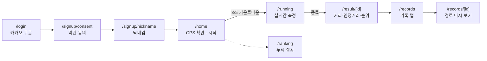

### 예외 흐름

기획 단계에서 정의하고([`docs/05-policy.md`](docs/05-policy.md) P1~P14), 구현·실측으로 확인한 것들이다.

| 상황 | 사용자에게 보이는 것 | 다음 행동 | 구현 |
|---|---|---|---|
| 위치 권한 거부 (P1) | "위치 권한을 허용해야 러닝을 시작할 수 있습니다" + 설정 경로 안내, 시작 버튼 비활성 | 권한 허용 후 재확인 | ✅ |
| GPS 신호 2초 이상 끊김 (P3) | GPS 경고 아이콘 + "GPS 신호가 끊겼습니다". 끊긴 구간은 **즉시** 거리에서 제외 | 신호 복구 시 그 지점부터 재측정 | ✅ |
| **화면이 꺼져 있던 구간** (D1) | "화면이 꺼져 있던 동안은 기록되지 않았습니다" 안내 | 복귀 후 새 segment로 계속 측정 | ✅ |
| 이미 진행 중인 러닝이 있음 (P7) | "이미 진행 중인 러닝이 있습니다" — 다른 기기 포함 | 진행 중 세션으로 복귀 또는 종료 | ✅ |
| 다른 기기가 러닝을 인수·종료함 (D14) | 원래 기기에 인수 사실 안내 | 결과 화면으로 이동 | ✅ |
| 기기 시계가 어긋남 | GPS 끊김과 **구분해서** 별도 안내 | 시계 보정 안내 | ✅ |
| 인터넷 끊김 (P14) | 측정은 계속, 업로드만 보류. offline과 rate-limited를 구분해 안내 | 복구 시 자동 업로드 | ✅ |
| 닉네임 미입력 / 9자 초과·공백·특수문자 / 중복 (P10) | **사유별로 다른 문구** 3종 | 재입력 | ✅ |
| Zone 밖에서만 달림 | 결과 화면에 "랭킹 미반영", 개인 기록에는 정상 저장 | — | ✅ |
| 랭킹 데이터 없음 | "아직 랭킹 데이터가 없습니다" (랭킹 미반영보다 **우선**) | — | ✅ |
| 기록 0건 (신규 가입 직후) | 빈 상태 화면 + 첫 러닝 시작 CTA | 러닝 시작 | ✅ |
| 종료 저장·순위 계산 실패 (P14) | 오류 상태 + "다시 시도". 성공 전까지 기록 탭·랭킹에 넣지 않음 | 재시도 | ✅ |
| 진행 중 러닝이 있는데 로그아웃·탈퇴 시도 (P12) | "진행 중인 러닝을 먼저 종료해 주세요" — 서버에서 차단 | 러닝 종료 후 재시도 | ✅ |

### 기획 문서

프로젝트 **시작 전**에 작성했고, 커밋 이력으로 확인할 수 있다(#2 · #18 · #20 — 2026-09-08 ~ 09-11, 첫 화면 구현 #32보다 앞선다).

[01 문제 정의](docs/01-problem.md) → [02 업무 흐름](docs/02-workflow.md) → [03 요구사항](docs/03-requirements.md) → [04 기능](docs/04-features.md) → [05 정책](docs/05-policy.md) → [06 데이터](docs/06-data.md) → [07 화면](docs/07-screens.md) · [PRD](docs/PRD.md) · [00 백로그](docs/00-backlog.md)

---

## 2. 디자인 시스템

### 두 도구를 오간 흐름

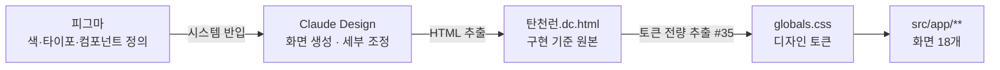

| 도구 | 어느 단계에 썼나 | 원본 여부 |
|---|---|---|
| 피그마 | 색·타이포·Lucide 아이콘·컴포넌트를 **처음 정의** | 시스템의 원본 |
| Claude Design | 피그마 시스템을 가져와 **화면 단위로 세부 조정**, 18개 화면 생성 | **구현의 원본 (source of truth)** |
| `탄천런.dc.html` | Claude Design 결과를 파일로 추출한 것 | 저장소에 커밋된 기준 파일 |

**팀 확정(2026-09-14)**: 화면 구현의 기준은 기획 문서가 아니라 **캡처된 디자인**이다. 이 규칙은 [`CLAUDE.md` §10](CLAUDE.md)에 못박혀 있고, 문서와 구현이 갈리면 문서를 고치지 않고 [`modify/`](modify/)에 기록한다.

### 정의 — 디자인 토큰

임의 hex 사용을 금지하고, `탄천런.dc.html`에서 값을 **전량 추출**해 [`src/app/globals.css`](src/app/globals.css)에 토큰으로 넣었다(#35). 값마다 디자인 원본의 줄 번호가 주석으로 달려 있다.

| 구분 | 정의 |
|---|---|
| 색 — 배경 | `bg-background` `#FBF7EF` · `bg-canvas` `#E9F1FA` · `bg-surface` `#FFFFFF` · `bg-surface-muted` `#F1EDE2` |
| 색 — 글자 | `text-foreground` `#1E2E4F` · `text-subtle` `#6A7488` · `text-muted` `#8B93A5` · `text-disabled` `#B6BDC9` |
| 색 — 의미 | `bg-primary` `#2F6FE8` · `text-success` `#3F7F31` · `bg-danger` `#EF6A5E` · `text-error` `#C4483C` · `text-warning` `#9B7419` |
| 타이포 | 9단계 — `text-caption`(11) `text-label`(12) `text-note`(13) `text-content`(15) `text-button`(17) `text-title`(20) `text-metric`(26) `text-display`(32) `text-hero`(34) |
| 모서리 | 8단계 — `rounded-xs`(12) ~ `rounded-3xl`(24) · `rounded-full` |
| 그림자 | 7종 — `shadow-card` `shadow-modal` `shadow-primary` `shadow-button` `shadow-raised` `shadow-toast` `shadow-danger` |
| 아이콘 | Lucide |

### 컴포넌트

두 화면 이상이 쓰는 것만 [`src/components/shared/`](src/components/shared/)에 둔다. 한 화면에서만 쓰는 조각은 그 화면 폴더 안에 둔다 — **이 규칙 하나로 폴더 구조가 결정된다.**

| 컴포넌트 | 책임 | 상태·변형 |
|---|---|---|
| `AppShell` | 모바일 컬럼 폭 · safe-area · 세로 스크롤 | `header` / `bottom` 슬롯, `padded` |
| `Header` | sticky 상단 · 좌측 정렬 제목 | `showBack` · `backHref` · `right` 슬롯 |
| `BackButton` | 뒤로 가기 | 시각 40×40 / 터치 48×48 |
| `BottomNav` | 홈 3탭 (달리기·랭킹·기록) | `usePathname` 기반 활성 탭, 하위 경로 포함 |
| `NaverTancheonMap` | 실제 위경도 지도 | 마커 `current` / `gps-lost` / `finished`, `loading`·`ready`·`credential`·`network` 4상태 |

### 디자인 vs 구현

<!-- TODO(#209): 피그마 · Claude Design 캡처를 docs/images/ 에 넣고 빈 칸을 채운다 -->

실제 구현은 integration 배포에서 찍었다. 지도는 NAVER Maps 실제 타일이다. 러닝은 **탄천 Ranking Zone 안에서 출발해 Zone 밖으로 나가도록** 만들어, 총 거리와 탄천 인정 거리가 갈리는 장면을 담았다 — 세 장 모두 같은 러닝이고, 러닝 진행은 달리는 도중(0.49km 중 0.34km 인정) · 결과는 종료 시점(0.55km 중 0.34km 인정)이다.

| 화면 | 피그마 | Claude Design | 실제 구현 |
|---|---|---|---|
| 홈 — 달리기 탭 | | | 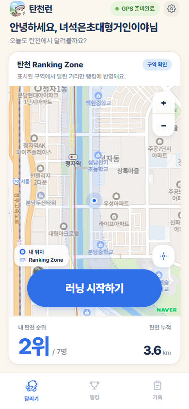 |
| 러닝 진행 | | | 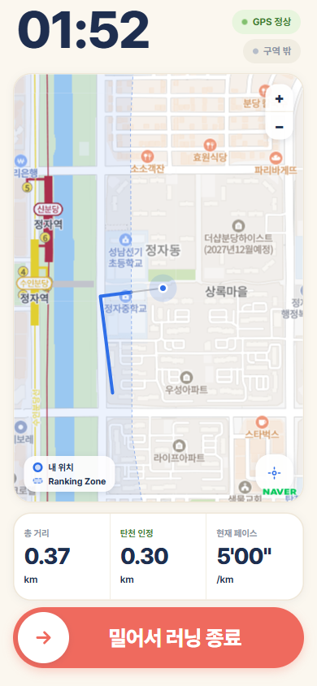 |
| 결과 | | | 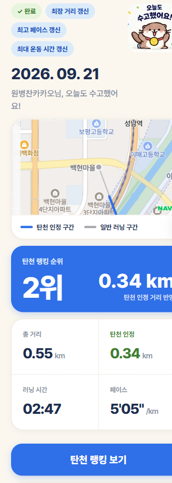 |

### 디자인 시스템을 바꿨을 때

일러스트 SVG 지도를 실제 위경도 지도로 교체하면서, **쓰는 곳이 0이 된 지도 색 토큰 6개**(`map-block` · `map-road` · `map-park` · `map-water` · `map-water-edge` · `map-label`)를 `globals.css`에서 제거했다(#174 · #177). 토큰이 한곳에 모여 있어 사용처를 전수 확인하고 한 번에 지울 수 있었다.

---

## 3. Agent 구성

### 흐름

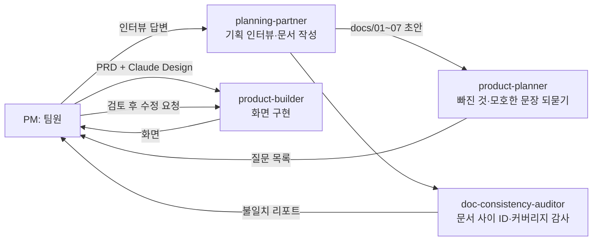

되돌아가는 경로가 둘이다 — `product-planner`와 `doc-consistency-auditor`는 **결과물을 내지 않고 질문·리포트만 돌려주는** 검토 전용 에이전트라, 출력이 항상 PM에게 되돌아온다.

### 역할별 Agent

정의 파일은 [`.claude/agents/`](.claude/agents/)에 있다.

| Agent | 역할 | 입력 | 출력 | 제약 (하지 말 것) |
|---|---|---|---|---|
| `planning-partner` | 기획 인터뷰를 하나씩 던져 `docs/` 양식에 받아 적고, 발산 질문으로 후보를 `[제안]` 표시로 보탠다 | 팀의 인터뷰 답변, 확정된 앞 문서 | `docs/01~07` 문서 양식 | **팀 대신 정하지 않는다.** 앞 문서만으로 채울 수 있는 06·07·PRD는 묻지 않고 일괄 작성 |
| `product-planner` | 기획 문서를 읽고 빠진 것·모호한 문장을 **질문으로** 돌려준다 | `docs/` 아래 문서 | 질문 목록 | 도구가 `Read` 뿐 — **문서를 고칠 수 없다** |
| `doc-consistency-auditor` | 문서 **사이**의 ID 참조·커버리지·후순위 상태 불일치를 찾는다 | `docs/00~06` | 불일치 리포트 | 읽기 전용. 한 문서 **안**의 빈칸은 보지 않는다(그건 product-planner 몫) |
| `product-builder` | PRD와 Claude Design을 입력으로 화면을 만든다 | PRD, `탄천런.dc.html` | 화면 코드 | **첨부 밖의 것을 만들지 않는다.** 서버·새 폴더가 필요하면 만들지 않고 되묻는다 |

책임이 겹치지 않는다 — 기획 인터뷰(`planning-partner`) / 한 문서 안 검토(`product-planner`) / 문서 사이 검토(`doc-consistency-auditor`) / 화면 구현(`product-builder`)이 서로 다른 입력을 본다.

### 지시문 핵심 발췌

`product-planner`의 제약이 가장 효과가 컸다.

```
도구: Read 만 부여
→ 검토 에이전트가 "질문을 돌려주는" 대신 문서를 직접 고쳐 버리는 사고를 구조적으로 막는다.
   권한으로 막으면 프롬프트에 "고치지 마라"라고 적는 것보다 확실하다.
```

### 지시문 운영 이력

`.claude/agents/`의 세 에이전트(planning-partner · product-planner · product-builder)는 **강사가 작성한 프롬프트**라 [`CLAUDE.md`](CLAUDE.md)에 "받아 쓰는 것이 원칙이며 임의로 고치지 않는다"로 고정했다. 필요한 역할은 **고치는 대신 추가**했다.

- **추가**: `doc-consistency-auditor` — 문서를 고칠 때마다 01~06 사이의 R/F/P 번호 참조가 깨지는 문제가 반복돼, 문서 **사이**만 보는 읽기 전용 에이전트를 새로 만들었다. 기존 세 에이전트와 역할이 겹치지 않도록 `description`에 범위를 명시했다.
- **에이전트 대신 Skill로 고정한 것**: 반복 절차(PR 준비·버그 수정·리뷰)는 에이전트를 늘리지 않고 Skill로 뺐다 → 4절.

---

## 4. 프로젝트 규칙 (하네스)

### CLAUDE.md 핵심

[`CLAUDE.md`](CLAUDE.md)가 최상위 규칙이고, 세부는 [`.claude/rules/`](.claude/rules/) 5개로 나눴다.

| 절 | 내용 |
|---|---|
| 1. Source of Truth | 작업 전 확인 순서 6단계 (branch 상태 → Issue → 기획 문서 체인 → 기존 코드 → rules → 명령 문서) |
| 2. Work Scope | 1 Issue = 1 branch = 1 PR. **요청받지 않은 리팩터링·파일 이동·formatting sweep 금지** |
| 3. Git | `main`·`develop` 직접 개발 금지, force push·`reset --hard` 금지, **push·merge·deploy는 명시적 요청 없이 실행 금지** |
| 5. Quality | 불필요한 `any` 금지, error 조용히 삼키기 금지, loading/empty/error/success 구분 |
| 6. Security | `.env`·token·secret을 읽거나 출력하거나 commit하지 않는다. **인증 체크를 UI 노출 여부로 대체하지 않는다** |
| 9. 코드 문서 | `docs/PROJECT_COMMANDS.md` · `docs/ARCHITECTURE.md`를 `@` 참조로 항상 로드 |
| **10. 구현 기준은 디자인이다** | 기획 문서가 아니라 `탄천런.dc.html`이 기준. 어긋나면 **문서를 고치지 말고** `modify/`에 기록 |

폴더 구조와 `src/server` · `src/domain` · `src/client` 경계는 [`docs/ARCHITECTURE.md`](docs/ARCHITECTURE.md)에 있다. import 방향은 `server → domain` 한쪽뿐이고, `src/server` 아래는 예외 없이 `import "server-only";`로 시작한다.

### CLAUDE.md를 3번 고쳤다 — 각각 무엇을 막으려고

| 시점 | 무엇을 바꿨나 | 어떤 실수를 막으려고 |
|---|---|---|
| 2026-09-11 (#18) | 협업 규칙·에이전트 절 추가 | 문서 작업이 사람마다 다른 양식으로 갈라지던 것 |
| 2026-09-14 (#36) | 팀 병렬 작업 가이드 | 여러 명이 같은 공용 파일(`globals.css` · `shared/*` · `layout.tsx`)을 동시에 고쳐 충돌하던 것 |
| 2026-09-15 (#66) | Git workflow를 `feature → develop → main` 2단계로 전환 | 이슈 PR이 `main`에 직접 들어가 통합 검증 없이 배포되던 것 |

### 만들어 둔 Skill

[`.claude/skills/`](.claude/skills/) 6개. 팀원 누구나 같은 결과를 얻도록 절차를 파일로 고정했다.

| 이름 | 하는 일 |
|---|---|
| `prepare-pr` | 현재 branch 변경을 리뷰 가능한 PR로 정리 — `CLAUDE.md` §8이 이 Skill을 직접 가리킨다 |
| `implement-feature` | Issue 단위 기능을 기존 구조를 존중해 최소 범위로 구현 |
| `fix-bug` | 재현 → 원인 → 최소 수정 → 회귀 방지 |
| `review-pr` | PR diff를 요구사항·회귀·타입·에러 처리·보안·테스트 관점으로 검토 |
| `review-brief` | 팀원이 길게 쓴 리뷰 글을 "무엇이 문제인지" 읽히는 브리핑으로 변환 |
| `deploy-check` | 배포 직전 릴리즈 위험과 필수 검증 확인 |

### 검증 절차

명령은 [`docs/PROJECT_COMMANDS.md`](docs/PROJECT_COMMANDS.md)에 전부 있다.

```bash
npm run lint    # ESLint. 출력이 없으면 위반 0
npm run build   # TypeScript 타입 검사 포함 — 별도 typecheck 명령이 없는 이유
npm test        # Vitest. 순수 함수만 (src/**/*.test.ts, 8개 파일)
```

**무엇을 자동으로 검증하지 못하는지도 문서에 적어 뒀다.** `npm test`는 화면·DB·네트워크 없이 값만으로 판정되는 순수 함수만 돈다. `src/app`과 DB를 거치는 경로는 lint·build·브라우저 확인 세 가지뿐이다. PR에 "테스트 완료"라고 적지 않고 **실제로 한 것만** 적는 규칙을 [`CONTRIBUTING.md`](CONTRIBUTING.md)에 넣었다.

CI([`.github/workflows/ci.yml`](.github/workflows/ci.yml))가 PR과 `develop`·`main` push에서 lint·test·build를 자동 실행한다(#135 · #165).

### Claude가 틀린 것을 잡아낸 실제 사례

**사례 1 — 누적 거리 동점 시 랭킹이 500을 뱉던 결함 (#144 → #158)**

- **어디서 발견**: MVP Backend Gate 2차 실측(`modify/2026-09-17-mvp-backend-gate.md` 6절). 코드 리뷰가 아니라 **판정 절차를 밟다가** 나왔다
- **무엇이 틀렸나**: 누적 거리가 같을 때 tie-break로 시각을 비교하는데, 문자열 시각을 그대로 비교해 던졌다
- **어떻게 고쳤나**: 재현 테스트를 `src/server/ranking/rank.ts`의 순수 함수로 떼어 내 먼저 추가하고 수정. 순수 함수라 `npm test` 대상이 된다

**사례 2 — migration이 pooled URL로 나가던 문제 (#102 → #103)**

- **어디서 발견**: Neon 연결 설정 검토 중
- **무엇이 틀렸나**: `drizzle.config.ts`가 `DATABASE_URL`(pooled)을 집어서, PgBouncer transaction mode에서 DDL이 실패하거나 조용히 이상하게 돌 수 있었다. **migration이 반쯤 적용된 상태는 실패보다 훨씬 비싸다**
- **어떻게 고쳤나**: `DATABASE_URL_UNPOOLED`를 먼저 집고, pooled밖에 없으면 **오류로 멈추게** 했다. 조용히 진행하지 않는 쪽을 택했다

### 기획과 구현이 갈린 지점을 버리지 않았다 — `modify/` 44개

구현이 기획 문서와 다를 때 **문서를 고치지 않고** [`modify/YYYY-MM-DD-<화면>.md`](modify/)에 세 줄로 남긴다.

```markdown
- **문서**: (문서가 말하는 것 + 파일:줄)
- **디자인 · 구현**: (실제로 한 것 + 디자인 줄 번호)
- **고쳐야 할 곳**: (나중에 손댈 문서 위치)
```

파일명에 화면 이름을 넣어 **같은 날 여러 명이 작업해도 충돌하지 않게** 했다. 44개 중 대표적인 것:

- [`2026-09-16-background-gps.md`](modify/2026-09-16-background-gps.md) — 기획은 "화면이 꺼져도 측정 계속"이지만 Web-only에서는 불가능. 제약을 수용하고 사용자에게 알리는 쪽으로
- [`2026-09-16-auth.md`](modify/2026-09-16-auth.md) — 기획은 "로그아웃 전까지 유지", 구현은 **고정 30일** 세션
- [`2026-09-17-mvp-backend-gate.md`](modify/2026-09-17-mvp-backend-gate.md) — MVP Gate 판정 기록 4회차

---

## 5. 협업 방식

### 브랜치 전략

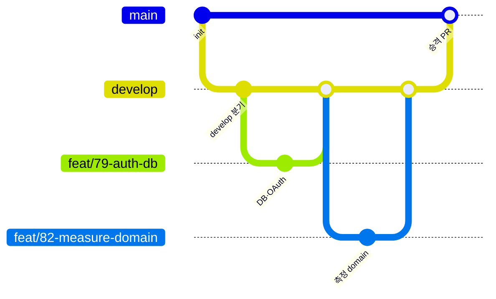

`feature → develop → main` 2단계다. 규칙은 [`CONTRIBUTING.md`](CONTRIBUTING.md)와 [`.claude/rules/git-workflow.md`](.claude/rules/git-workflow.md)에 있다.

| branch | 역할 |
|---|---|
| `main` | 항상 배포 가능. **이슈 PR을 직접 받지 않고** `develop` → `main` 승격 PR과 hotfix만 받는다 |
| `develop` | 여러 이슈를 합쳐 route·state·UI 통합을 검증하는 integration branch. 직접 개발하지 않는다 |
| `feat/<issue>-<slug>` 등 | 이슈 하나의 구현. `develop`에서 만들고 `develop`으로 PR |

- **이름 규칙**: `feat/` `fix/` `hotfix/` `refactor/` `test/` `docs/` `chore/` + `<이슈번호>-<kebab-case slug>` (예: `feat/84-naver-map`)
- **커밋**: Conventional Commits (`feat:` `fix:` `docs:` `chore:` …)
- **merge 규칙**: 이슈 PR·hotfix는 **Squash merge**, `develop` → `main` 승격과 동기화는 **merge commit**
- **이슈 연결**: 이슈 PR은 `Refs #123`(develop 대상 PR에서는 closing keyword가 작동하지 않는다), 승격 PR에서 `Closes #123`으로 일괄 종료

### 규모

| 항목 | 수 |
|---|---|
| 이슈 | 95개 |
| merge된 PR | 105개 |
| `develop` → `main` 승격 PR | 9회 (#71 · #107 · #157 · #169 · #183 · #189 · #198 · #205 · #207) |
| 기여자 | 4명 전원이 PR·커밋 보유 |
| 라벨 | 기본 + 팀 정의 `feature` `chore` `refactor` `test` `docs` `priority:high` `blocked` `ready-for-review` + 화면 묶음 `묶음:A-가입` ~ `묶음:D-설정` |

템플릿은 실제로 쓰였다 — [`.github/ISSUE_TEMPLATE/`](.github/ISSUE_TEMPLATE/) 3종(`bug` · `feature` · `task`) · [`.github/PULL_REQUEST_TEMPLATE.md`](.github/PULL_REQUEST_TEMPLATE.md) · [`.github/CODEOWNERS`](.github/CODEOWNERS).

### 역할 분담

| 팀원 | 담당 영역 | 주요 PR |
|---|---|---|
| [@wol20670](https://github.com/wol20670) | 기획 문서 전체 · 디자인 토큰 추출 · 하네스(CLAUDE.md·rules·skills) · 앱 기반 · 지도/기록 백엔드 · **통합과 승격 오케스트레이션** · MVP Gate 판정 | #2 #18 #32 #35 #66 #96 #101 #143 #188 |
| [@eunjung01230](https://github.com/eunjung01230) | **인증·세션 백엔드**(DB·OAuth·가입·닉네임·러닝 세션·설정·탈퇴·랭킹) · 설정/위치/동의/러닝 진행/홈 화면 | #92 #94 #95 #104 #105 #73 #76 |
| [@SeungBinYang](https://github.com/SeungBinYang) | **Claude Design 반입** · **측정 도메인**(WGS84·Zone 판정·페이스) · GPS 실측 수집 · **CI 구축** · 화면 6개 | #28 #93 #97 #135 #165 |
| [@softy20](https://github.com/softy20) | **러닝 종료 2단계 처리와 결과 화면** · 랭킹 빈 상태 · 설정 네비게이션 | #77 #99 #130 #131 |

### 병렬로 작업한 방법

화면 18개를 **묶음 A~D**로 나누고, 먼저 공용 선행 2건(#33 지도 · #34 탭바)을 끝낸 뒤 병렬로 들어갔다.

- **충돌하지 않는 곳**: 자기 `src/app/<route>/` 폴더 안. 그 화면에서만 쓰는 조각도 같은 폴더에 둔다
- **건드리기 전에 말해야 하는 곳**: `globals.css` · `components/shared/*` · `layout.tsx` · `page.tsx` · `package.json` · 설정 파일 — [`docs/SCREEN_ASSIGNMENTS.md`](docs/SCREEN_ASSIGNMENTS.md)에 표로 고정
- **백엔드는 화면 이슈를 재사용하지 않았다** — 인증·세션·GPS·저장·랭킹은 별도 트랙 B0~B9로 분리하고, 이슈마다 **선행 조건**(어느 PR이 develop에 들어가야 착수 가능한지)을 명시했다: [`docs/BACKEND_ASSIGNMENTS.md`](docs/BACKEND_ASSIGNMENTS.md)
- **결정은 한곳에 모았다** — 플랫폼·인증 스택·데이터 정책을 #78 한 이슈의 decision ledger(D1~D15)로 두고, 구현 이슈는 "필요한 D가 CONFIRMED인지"만 확인하고 착수했다

### 충돌 해결 사례

저장소의 머지 커밋 22건을 전부 재현해(`git merge-tree --write-tree`) 충돌이 났던 자리를 찾았다. **5건**이고,
해결 근거는 모두 머지 커밋 메시지에 남아 있다.

#### 사례 1 — 두 사람이 같은 파일을 동시에 만들었다

- **어느 파일**: `src/app/records/mock.ts` — 머지 [`1696a87`](https://github.com/NextComm1T/tanchunrun/commit/1696a87) (`develop` → `feat/45-record-detail`, 2026-09-15)
- **왜 생겼나**: 기록 탭(#44)과 기록 상세(#45)가 **같은 세션 mock 을 각자 만들었다.** 같은 날 #44 가 `develop` 에 먼저 들어갔고, #45 는 이미 같은 경로에 자기 버전을 갖고 있었다. 공통 조상에 그 파일이 없어 git 이 병합할 기준을 잡지 못하는 `add/add` 충돌이 났다
- **어떻게 해결했나**: 한쪽을 버리지 않고 **손으로 합쳤다.** `develop` 쪽 타입 계약(세션 `s1`~`s6` · 필드명 `totalDistanceKm` · `tancheonDistanceKm` · `durationSec` · `paceSecPerKm` · `PersonalBest` · empty 상태)을 그대로 두고, 기록 상세에만 필요한 `route`와 `findSession`을 **확장**했다. 결과적으로 두 화면이 같은 세션 데이터를 공유하게 되면서 계약이 하나로 정리됐다

#### 사례 2 — 내용은 안 겹치는데 이력 때문에 났다

- **어느 파일**: `src/server/db/schema.ts` · `src/server/auth/identity.ts` · `src/server/auth/session.ts` · `drizzle/meta/_journal.json` — 머지 [`9c41e1a`](https://github.com/NextComm1T/tanchunrun/commit/9c41e1a) (`develop` → `feat/80-signup-nickname`, 2026-09-16)
- **왜 생겼나**: `feat/80`은 `feat/79`(DB·인증 기반) 위에 쌓아 올린 **stacked PR** 이었다. #79 가 PR #92 로 **squash merge** 되면서 `develop` 에 원래 이력과 이어지지 않는 새 커밋이 하나 생겼고, 그 커밋이 `feat/80` 이력에는 없어서 같은 파일이 양쪽에서 "새로 추가된" 것처럼 보였다. **내용이 겹쳐서 난 충돌이 아니라 squash merge 의 이력 artifact 다**
- **어떻게 해결했나**: `develop` 쪽 네 파일이 이 브랜치가 이미 흡수한 #79 최종본과 **blob 해시까지 동일한 것을 확인한 뒤** 브랜치 쪽으로 해결했다. 브랜치 쪽 = #79 최종본 + #80 의 추가 변경이므로 #79 의 변경은 하나도 잃지 않는다. 머지 결과 tree 가 머지 이전 tree 와 완전히 같아 **내용 변화가 0** 임을 확인했고 `npm run lint` · `npm test` · `npm run build` 로 검증했다

#### 나머지 3건

| 머지 | 어느 파일 | 왜 | 어떻게 |
|---|---|---|---|
| [`4cd109b`](https://github.com/NextComm1T/tanchunrun/commit/4cd109b) `design-ysb` → `main` | `.claude/agents/planning-partner.md` · `product-planner.md` · `docs/06-backlog.md` | Claude Design 반입 브랜치가 파일을 `uploads/` 아래로 옮기는 동안 `main` 은 같은 파일을 수정 → `modify/delete` · `rename/delete` | 강사가 제공한 에이전트 정의는 **임의로 고치지 않는다**는 규칙에 따라 `main` 버전 유지. 백로그는 `main`의 `docs/00-backlog.md`를 본체로 두고 `uploads/` 사본은 원본으로 남김 |
| [`c0e2bff`](https://github.com/NextComm1T/tanchunrun/commit/c0e2bff) `develop` → `feat/79-auth-db` | `package.json` · `package-lock.json` · `docs/PROJECT_COMMANDS.md` | #82(측정 도메인)가 `vitest`를, #79 가 `drizzle-orm` · `openid-client` · `pg`를 **같은 `scripts` · `dependencies` 블록**에 추가 | 양쪽 **합집합**으로 해결. `package-lock.json`은 손으로 고치지 않고 합쳐진 `package.json`으로 `npm install` 재생성 |
| [`3fcb781`](https://github.com/NextComm1T/tanchunrun/commit/3fcb781) `develop` → `feat/81-run-session-start` | 사례 2의 4개 + `src/app/page.tsx` · `src/app/settings/LogoutRow.tsx` | 사례 2와 같은 원인 — 이번엔 #80 이 squash merge 되며 `feat/81` 이력에 없는 커밋이 생김 | 사례 2와 같은 절차(blob 해시 대조 → 브랜치 쪽 채택 → tree 변화 0 확인) |

#### 충돌을 줄이려고 한 것

- 화면 18개를 병렬로 만들었는데 **화면 코드에서 난 충돌은 `mock.ts` 1건뿐이다.** 자기 `src/app/<route>/` 폴더 안은 자유, 공용 파일은 건드리기 전에 말한다는 규칙([`docs/SCREEN_ASSIGNMENTS.md`](docs/SCREEN_ASSIGNMENTS.md) 「충돌 방지」)이 실제로 작동했다
- `modify/` 기록은 날짜만 쓰지 않고 `YYYY-MM-DD-<화면>.md`로 썼다. 같은 날 여러 명이 작업해도 겹치지 않게 하기 위해서고, **44개 파일에서 충돌 0건**이다
- 남은 4건은 전부 **backend track 의 stacked PR** 에서 났다. 화면 분업이 잘못된 게 아니라 "앞 이슈가 `develop`에 들어가야 다음 이슈를 착수할 수 있는" 구조와 squash merge 정책이 맞물린 결과다

---

## 6. 데모

### 실행

- **배포**: https://tanchunrun.vercel.app
- **로컬**: `npm install` → `.env.example`을 `.env.local`로 복사해 값 채우기 → `npm run dev` → http://localhost:3000
  - **3000 포트여야 한다.** 다른 포트로 뜨면 `APP_ORIGIN`과 provider에 등록된 callback 주소가 어긋나 로그인이 실패한다
  - 서버 전용 env 6개 중 하나라도 비면 `npm run dev`가 **시작 시점에 종료된다** — env 누락을 서버 시작 시 걸러 낸다
  - 자세한 절차: [`docs/PROJECT_COMMANDS.md`](docs/PROJECT_COMMANDS.md)

### 시연 순서

1. **로그인** — 카카오 또는 구글. 최초면 약관 동의 → 닉네임 설정으로 이어진다
2. **홈 (달리기 탭)** — 지도에 현재 위치와 탄천 Ranking Zone이 함께 표시되고, GPS 확인이 끝나야 시작 버튼이 활성화된다
3. **러닝 시작** — 3초 카운트다운 후 러닝 화면. 총 거리 · 탄천 인정 거리 · 시간 · 현재 페이스 4항목이 실시간 갱신
4. **예외 시연** — 화면을 껐다 켜면 "화면이 꺼져 있던 동안은 기록되지 않았습니다" 안내가 뜬다 (Web-only 제약을 숨기지 않고 알리는 설계)
5. **종료** — 결과 화면에 6항목 + 경로 지도. **Zone 안 구간과 밖 구간이 다른 색으로 갈린다**
6. **랭킹 탭** — 누적 탄천 인정 거리 기준 순위, 본인 줄 강조
7. **기록 탭 → 기록 상세** — 누적 거리 2종 · 개인 최고 기록 3종 · 세션 목록 → 선택하면 그날 경로를 다시 본다

### 화면

| 로그인 | 랭킹 탭 | 기록 탭 | 회원탈퇴 |
|---|---|---|---|
| 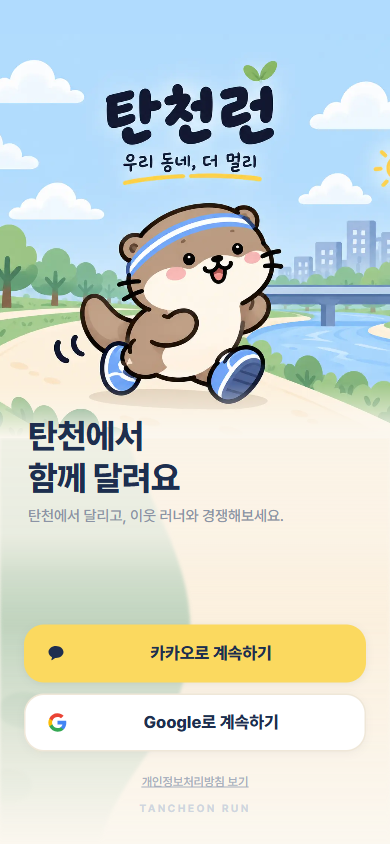 | 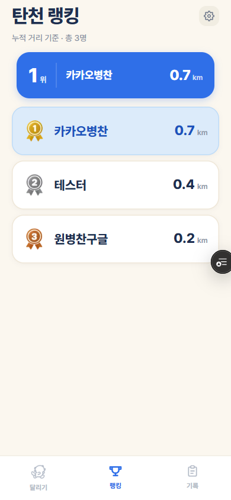 | 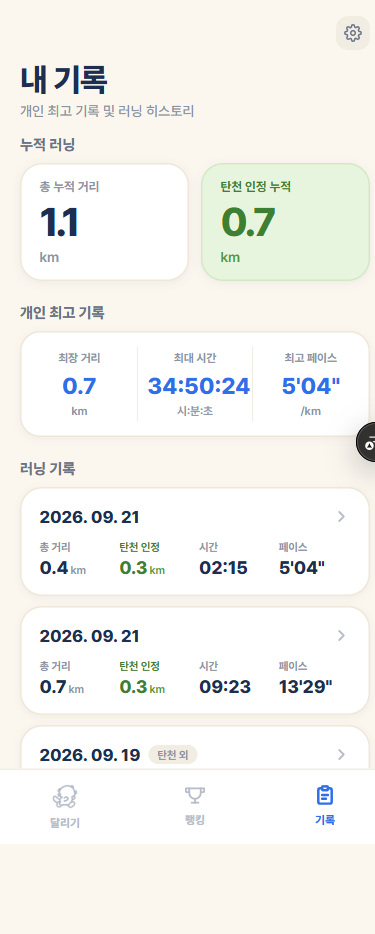 | 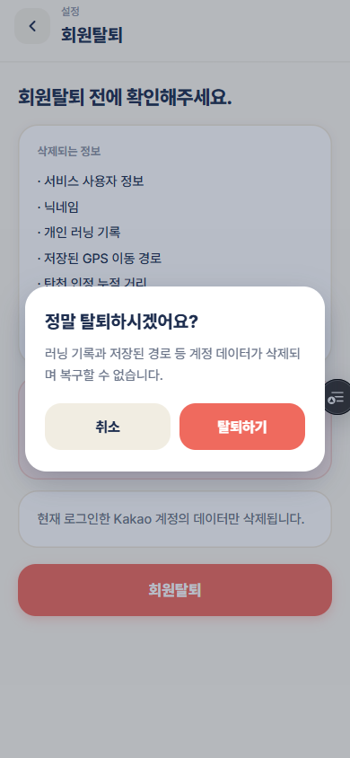 |

랭킹은 본인 줄을 강조하고(F5), 기록 탭은 누적 2종·개인 최고 기록 3종·세션 목록을 함께 보여 준다(F7).

회원탈퇴 화면은 **무엇이 지워지는지 7항목을 먼저 보여 주고** 한 번 더 확인을 받는다(F13·P13). 이 캡처들은 실제로 탈퇴를 실행해 얻은 것이다 — 계정·러닝·경로·랭킹 반영이 모두 사라지고 로그인 화면으로 돌아가는 것까지 확인했다.

### 현재 검증 상태

**숨기지 않고 적는다.** MVP Backend Completion Gate(#89)는 4차 판정까지 진행하고 **2026-09-19에 닫았다.** 「Gate 통과」를 선언하며 닫은 것이 아니라, **팀이 MVP 검증을 여기까지 하기로 하고 남은 것은 개별 Issue로 따라가기로** 한 것이다.

| 영역 | 판정과 그 뒤 |
|---|---|
| Auth / Signup / Running / Finish / Ranking / Records / Map / E2E | 통과 (실기기 실측) |
| Location / GPS | 4차에서 **부분 통과**. 사유였던 권한 복구(#200)·멈춤 안내(#201)는 재검증에서 **재현되지 않아 닫았다** — 결함으로 확정하지 못했고 코드도 바꾸지 않았다 |
| Failure | 4차에서 **부분 통과**. 사유였던 `src/app` 의 `catch` 33곳 전수 확인을 마쳤다 — **실패했는데 성공했다고 말하는 곳은 없었다** |
| D14 다기기 인수 흐름 | 4차에서 **미검증**이었고 그 뒤 확인됐다 — 데스크톱 「여기서 종료」 → 폰에 인수 안내(#148)까지 |

**끝까지 확인하지 못한 것** — 이쪽이 더 중요하다.

- **실기기 결과는 전부 사용자 보고다.** 지휘관이 직접 본 것은 로컬 하네스와 integration 실측뿐이다
- **iOS · Safari** — 범위 밖 결정(#78 D15). 결함이 아니라 의도적 범위 축소다
- **실패 A(API 차단) 재실측** — 로컬 결과를 그대로 뒀다
- **320px 폭에서 화면 꺼짐 안내(#202)의 줄바꿈** — 눈으로 재지 않았다

전체 판정 기록은 [`modify/2026-09-17-mvp-backend-gate.md`](modify/2026-09-17-mvp-backend-gate.md)에 4차에 걸쳐 남아 있다. 판정이 뒤집힌 자리는 지우지 않고 **다음 절이 앞 절을 대체하는 방식**으로 쌓았다.

---

## 7. 회고

<!-- ===== 이 절은 팀원이 직접 작성합니다 (Claude 대필 금지) ===== -->

### 잘 된 점

<!-- TODO(#212): 팀원 직접 작성 — 구체적 사례 1개 이상 -->

### 실패 사례와 개선

<!-- TODO(#212): 팀원 직접 작성 — 아래 표를 채운다 -->

| 무엇이 실패했나 | 왜 | 어떻게 고쳤나 |
|---|---|---|
| | | |

### 팀 안에서 공유한 Claude 활용 노하우

<!-- TODO(#212): 팀원 직접 작성 -->

저장소에 들어 있는 것: [`docs/CLAUDE_PROMPTS.md`](docs/CLAUDE_PROMPTS.md) (팀원용 복사-붙여넣기 프롬프트 모음) · [`.claude/skills/`](.claude/skills/) 6개 · [`.claude/rules/`](.claude/rules/) 5개

### 다음 프로젝트에서 다르게 할 것

<!-- TODO(#212): 팀원 직접 작성 — "더 열심히"가 아니라 실행 가능한 행동으로 -->

---

## 문서 지도

| 문서 | 내용 |
|---|---|
| [`CLAUDE.md`](CLAUDE.md) | 최상위 작업 규칙 |
| [`CONTRIBUTING.md`](CONTRIBUTING.md) | Issue → Branch → Commit → PR → Review → Merge 흐름 |
| [`docs/ARCHITECTURE.md`](docs/ARCHITECTURE.md) | 폴더 구조 · 경계 · 공용 컴포넌트 · 디자인 토큰 |
| [`docs/PROJECT_COMMANDS.md`](docs/PROJECT_COMMANDS.md) | 실행·검증 명령, DB 셋업, production backup/rollback |
| [`docs/01-problem.md`](docs/01-problem.md) ~ [`docs/07-screens.md`](docs/07-screens.md) | 기획 문서 체인 |
| [`docs/SCREEN_ASSIGNMENTS.md`](docs/SCREEN_ASSIGNMENTS.md) · [`docs/BACKEND_ASSIGNMENTS.md`](docs/BACKEND_ASSIGNMENTS.md) | 담당·상태 |
| [`modify/`](modify/) | 기획 문서와 구현이 갈린 지점 44건 |
